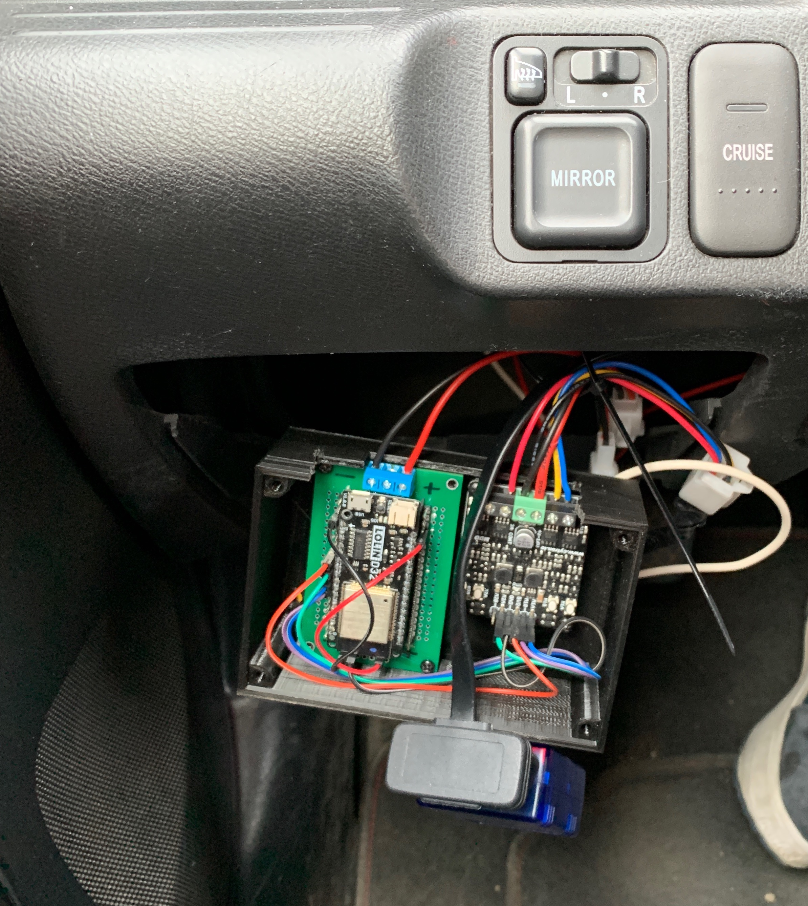
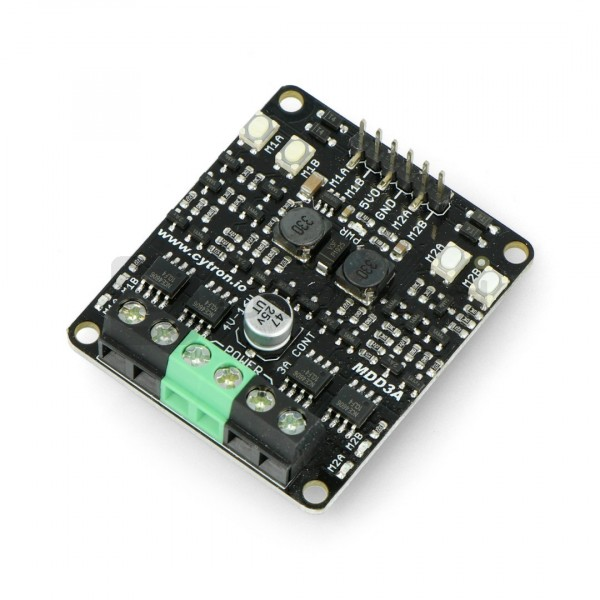
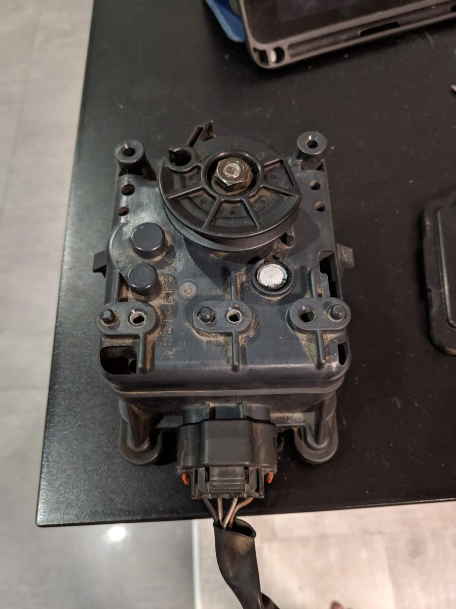
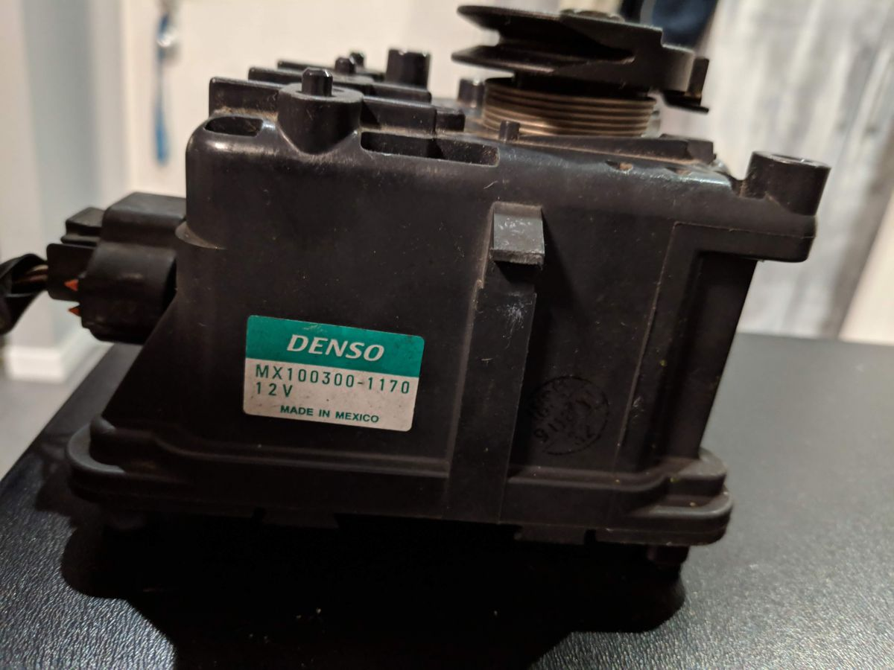

# arduino-cruise-control
Open Source Cruise Control module for cars that don't have CC and have cable driven throttle body

## Assembly

I currently don't have wiring diagram but it is quite simple.

Accessory 12V -> Step down -> 5V for ESP32
Accessory 12V -> Cruise Button (on/off) -> Cytron Input
Cytron 5V (goldpins) -> ESP32 (pin 16 - detecting button pressed)
CYTRON_M2A_CLUTCH_ON (goldpins) -> ESP32 (pin 17)
CYTRON_M1A_SPEED_UP (goldpins) -> ESP32 (pin 18)
CYTRON_M1B_SPEED_DOWN (goldpins) -> ESP32 (pin 19)
Common ground for all elements

## Hardware Components
### ESP32 Board
I'm using typical ESP32 development board.

### ELM327
I'm using V-LINK ELM327 connector

### Cytron - MDD3A
The Cytron MDD3A motor controller can control 2 DC motors or 1 stepper motor. The continuous current per level is 3 A (5 A high). The supply voltage is from 4 V to 16 V. The controller works with a logical voltage of 1.8 V, 3.3 V, 5 V and 12 V (PWM and DIR), thanks to which it is possible to control using a microcontroller such as Arduino or Raspberry.

 * Store: https://www.cytron.io/p-3amp-4v-16v-dc-motor-driver-2-channels
 

### Honda Cruise Control Actuator Motor - Denso MX100300-1170
Denso MX100300-1170 throttle cable control motor from a Honda Accord 1.8 from 1998. Used to operate throttle body with steel cable. 

